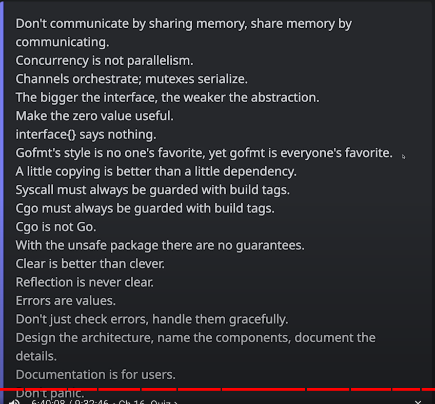

# Golang
This repository contains all the basics of Golang and my studies on them, as well as data structures and algorithms (DSA) with Golang.
Also sometimes some scripts to structure your go projects.



Best step by step resource
[Go By Example](https://gobyexample.com/)

Best way to structure your project
[go-blueprint.dev](https://www.go-blueprint.dev)

Chats
[simple questions](https://chatgpt.com/c/67c57ed6-4694-800b-a206-a279de9700bc)
[advanced](https://chatgpt.com/c/67c56847-3130-800b-b669-3cd55ee2fd5f)

- https://www.interviewbit.com/golang-interview-questions/
- https://www.turing.com/interview-questions/golang
- https://www.geeksforgeeks.org/typescript-interview-questions/
- https://chatgpt.com/c/67c73666-53b0-800b-926a-ef9b0bb68b47
- https://www.geeksforgeeks.org/react-interview-questions/
- https://chatgpt.com/c/67c7c1b5-6a98-800b-881f-7989a003702e

- [full stack](https://chatgpt.com/c/67c96032-c164-800b-abce-16340e5d3e05)

- https://101blockchains.com/top-solana-interview-questions-and-answers/
- https://www.usebraintrust.com/hire/interview-questions/solana-developers
- http://chatgpt.com/c/67c9b943-9e8c-800b-a0c4-36f866712780

css
https://chatgpt.com/c/67c7d7f2-e278-800b-a654-5b3907a08a5f
fullstack interview questions
little leetcode

Common question
You're being asked about **channel behavior in Golang**, specifically the differences between **unbuffered** and **buffered channels**. Channels are a key feature in Go’s concurrency model, allowing goroutines to communicate safely.

---

### **1. Understanding Unbuffered Channels**
In an **unbuffered channel**, sending and receiving operations are **synchronous**, meaning:
- **The sender blocks** until a receiver is ready to receive the value.
- **The receiver blocks** until a sender puts a value into the channel.

#### **Example: Unbuffered Channel (Blocking Behavior)**
```go
package main

import (
	"fmt"
	"time"
)

func main() {
	ch := make(chan string) // Unbuffered channel

	go func() {
		fmt.Println("Sending data...")
		ch <- "Hello, Go!" // Blocks until the receiver is ready
		fmt.Println("Data sent")
	}()

	time.Sleep(time.Second) // Simulate delay in receiver
	msg := <-ch             // Receiving data (unblocks sender)
	fmt.Println("Received:", msg)
}
```
**Expected Output (with delay in receiver):**
```
Sending data...
Received: Hello, Go!
Data sent
```
**Explanation:**
- The sender (`ch <- "Hello, Go!"`) **blocks** until the receiver (`<-ch`) is ready.
- The program does not proceed to `"Data sent"` until the message is received.

---

### **2. Understanding Buffered Channels**
In a **buffered channel**, sending and receiving operations are **asynchronous up to the buffer limit**:
- The **sender blocks** **only when the buffer is full**.
- The **receiver blocks** **only when the buffer is empty**.

#### **Example: Buffered Channel (Non-blocking Until Full)**
```go
package main

import "fmt"

func main() {
	ch := make(chan string, 2) // Buffered channel with capacity 2

	ch <- "Message 1"
	ch <- "Message 2"
	// ch <- "Message 3"  // Would block here if uncommented, since the buffer is full

	fmt.Println(<-ch) // Removes "Message 1" from buffer, making space
	ch <- "Message 3"  // Now, this can proceed without blocking

	fmt.Println(<-ch)
	fmt.Println(<-ch)
}
```
**Expected Output:**
```
Message 1
Message 2
Message 3
```
**Explanation:**
- `ch <- "Message 1"` and `ch <- "Message 2"` do **not** block because the buffer size is 2.
- If we attempted to send `"Message 3"` **before** reading from the channel, the sender would **block** since the buffer is full.
- Once a receiver removes a message, space is freed, allowing further sends.

---

### **Key Differences Between Unbuffered and Buffered Channels**
| Feature               | Unbuffered Channel            | Buffered Channel              |
|----------------------|-----------------------------|------------------------------|
| **Blocking Behavior** | Sender blocks until receiver receives the value | Sender blocks **only if buffer is full** |
| **Synchronization**  | Forces goroutines to wait for each other | Allows decoupling of sender and receiver up to buffer limit |
| **Use Case**        | When strict synchronization is required | When you want to store messages temporarily and avoid blocking |

---

### **How to Explain in an Interview**
#### **Scenario-Based Explanation**
- **Interviewer:** Can you explain how unbuffered and buffered channels work?
- **Your Answer:**
  > In Go, channels enable goroutines to communicate safely. Unbuffered channels synchronize the sender and receiver, meaning the sender **blocks until a receiver is ready** and vice versa. Buffered channels, on the other hand, allow the sender to proceed without an immediate receiver, as long as there is space in the buffer. However, if the buffer is full, the sender will block. Similarly, the receiver blocks only when the channel is empty.

#### **Follow-up: When Would You Use Each?**
- **Unbuffered channels** are useful when you need **strict synchronization** between goroutines, like coordinating worker execution.
- **Buffered channels** are useful when **you want to store intermediate data** without immediately blocking the sender, like a job queue.

Would you like a real-world example, such as a worker pool using buffered channels? 🚀


### **Understanding `context` in Golang**
The `context` package in Golang is used for **managing timeouts, deadlines, and cancellation signals** in **concurrent** programs. It helps control **goroutines** efficiently.

---

## **1. Why Use `context`?**
- **Prevent Goroutine Leaks**: Without `context`, goroutines may keep running even after they are no longer needed.
- **Manage Timeouts**: Automatically stop execution if a task takes too long.
- **Pass Request-Specific Data**: Useful for APIs where requests need to carry metadata (e.g., user IDs, authentication tokens).

---

## **2. Creating a Basic Context**
The `context` package provides four ways to create a context:

| Function | Description |
|----------|------------|
| `context.Background()` | Root context, used at the top level. |
| `context.TODO()` | Placeholder when the context is undecided. |
| `context.WithCancel(ctx)` | Creates a cancelable context. |
| `context.WithTimeout(ctx, duration)` | Creates a context that **auto-expires** after a timeout. |
| `context.WithDeadline(ctx, time)` | Similar to timeout but uses a specific **timestamp**. |

---

## **3. Example: Using `context.WithCancel`**
🚀 **Goal:** Cancel a goroutine when the main function decides to stop it.

```go
package main

import (
    "context"
    "fmt"
    "time"
)

func worker(ctx context.Context) {
    for {
        select {
        case <-ctx.Done(): // Context canceled
            fmt.Println("Worker stopped!")
            return
        default:
            fmt.Println("Worker running...")
            time.Sleep(1 * time.Second)
        }
    }
}

func main() {
    ctx, cancel := context.WithCancel(context.Background())

    go worker(ctx) // Start worker goroutine

    time.Sleep(3 * time.Second) // Let the worker run for 3 sec
    fmt.Println("Main function says: Stop the worker!")
    cancel() // Cancel the context, stopping the worker

    time.Sleep(1 * time.Second) // Give time for the worker to exit
}
```

### **🔹 Output:**
```
Worker running...
Worker running...
Worker running...
Main function says: Stop the worker!
Worker stopped!
```
**🔍 Explanation:**  
- `context.WithCancel()` creates a **cancelable** context.
- The worker keeps running **until** `cancel()` is called.
- `ctx.Done()` **listens for cancellation** and exits.

---

## **4. Example: Using `context.WithTimeout`**
🚀 **Goal:** Automatically stop a function if it takes too long.

```go
package main

import (
    "context"
    "fmt"
    "time"
)

func longTask(ctx context.Context) {
    for {
        select {
        case <-ctx.Done(): // Timeout exceeded
            fmt.Println("Task timeout! Stopping...")
            return
        default:
            fmt.Println("Processing...")
            time.Sleep(1 * time.Second)
        }
    }
}

func main() {
    ctx, cancel := context.WithTimeout(context.Background(), 3*time.Second)
    defer cancel() // Ensure cleanup

    go longTask(ctx)

    time.Sleep(5 * time.Second) // Simulate waiting longer than timeout
}
```

### **🔹 Output:**
```
Processing...
Processing...
Processing...
Task timeout! Stopping...
```
**🔍 Explanation:**  
- `context.WithTimeout()` creates a context that **auto-cancels after 3 seconds**.
- `ctx.Done()` listens for cancellation and stops the function.
- The **worker stops automatically** after the timeout.

---

## **5. Passing Context to Functions**
Context is **always passed as the first argument** to functions that need it.

```go
func fetchData(ctx context.Context, url string) error {
    select {
    case <-time.After(2 * time.Second): // Simulate work
        fmt.Println("Fetched data from", url)
        return nil
    case <-ctx.Done(): // Context expired
        return ctx.Err()
    }
}

func main() {
    ctx, cancel := context.WithTimeout(context.Background(), 1*time.Second)
    defer cancel() // Cleanup

    err := fetchData(ctx, "https://example.com")
    if err != nil {
        fmt.Println("Error:", err) // Will print timeout error
    }
}
```
### **🔹 Output:**
```
Error: context deadline exceeded
```
**🔍 Explanation:**  
- **Timeout = 1 second**, but `fetchData()` takes **2 seconds**.
- The function **fails with a timeout error**.

---

## **6. Example: Context with Deadlines**
Instead of a timeout, we set a **fixed time** when the context should expire.

```go
ctx, cancel := context.WithDeadline(context.Background(), time.Now().Add(5*time.Second))
defer cancel() // Cleanup
```

This is useful when you want an operation to **stop at an exact time**.

---

## **7. Context Best Practices**
✔ Always pass `context.Context` as the **first argument** to functions.  
✔ Use `context.WithTimeout()` **for API calls** to prevent long waits.  
✔ Use `context.WithCancel()` **when stopping goroutines manually**.  
✔ Call `defer cancel()` to **release resources**.

---

### **🔹 TL;DR**
| Feature | Description |
|---------|------------|
| **`context.WithCancel`** | Cancels execution manually. |
| **`context.WithTimeout`** | Stops execution **after a duration**. |
| **`context.WithDeadline`** | Stops execution at a **fixed time**. |
| **`ctx.Done()`** | Used inside functions to listen for cancellation. |

Would you like a **real-world API example** using context? 🚀


A survival kit to beat APIs interview.

Here are 11 questions you need to know how to answer.

1. Can You Explain CRUD Operations in the Context of REST?

2. What Is the Difference Between PUT and PATCH?

3. What Are Common HTTP Status Codes, and What Do They Mean?

4. What Does It Mean for a REST API to Be Stateless?

5. How Do You Secure a REST API?

6. How Do You Version a REST API?

7. What Is Pagination, and How Is It Implemented in REST APIs?

8. Can You Discuss Rate Limits and Their Importance?

9. What Is Idempotency, and Why Is It Important?

10. How Can You Improve API Performance?

11. How Do You Document REST APIs?

APIs are the glue of modern systems; mastering their concepts is what keeps you at the top of the candidate list.
https://chatgpt.com/c/67c916f4-7a10-800b-905e-9be3223c2717


https://x.com/mdjunaidap/status/1675377879662886912


## Errors vs Panic
In Golang, `panic` and `errors.New` serve different purposes:

### 1. `panic`
- Used for unrecoverable errors that should immediately stop program execution.
- Typically used for critical failures, like accessing an out-of-bounds index in a slice or encountering an unexpected condition in a low-level function.
- Can be recovered using `recover()`, but this is generally discouraged except in very specific cases (like middleware in a web server).

Example:
```go
func divide(a, b int) int {
    if b == 0 {
        panic("division by zero")
    }
    return a / b
}
```

### 2. `errors.New`
- Used for returning errors in a controlled manner, allowing the caller to handle them properly.
- It does not stop execution; instead, it returns an error value that can be checked and handled.
- Preferred for expected failures, such as invalid input or external resource issues.

Example:
```go
import "errors"

func divide(a, b int) (int, error) {
    if b == 0 {
        return 0, errors.New("division by zero")
    }
    return a / b, nil
}
```

### **Which is Preferred?**
✅ **Use `errors.New` (or `fmt.Errorf`, `errors.Wrap`, etc.)** when the error is expected and should be handled by the caller.  
❌ **Avoid `panic` unless it's an exceptional, unrecoverable scenario** where the program cannot continue safely.

#### **General Rule:**
- **Use `panic`** for programming errors or fatal conditions (e.g., corrupted memory, unexpected nil pointers).
- **Use `errors.New`** for expected failures (e.g., invalid user input, failed DB connection).

For robust applications, **handling errors gracefully is always preferred** over panicking. 🚀